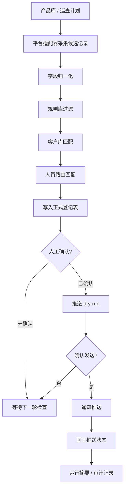

# 电商挂网监控流程公开版

这是一个经过脱敏处理的公开说明仓库，用来展示“电商挂网监控”系统的模块划分、业务流程、数据字段和运维环节。

本仓库不包含任何真实客户、员工、账号、Cookie、数据库、飞书/Lark Base token、机器人密钥、服务器地址、历史运行记录或生产部署脚本。公开版只保留可复用的产品思路和流程骨架，便于他人理解系统由哪些板块组成、每个环节如何衔接。

## 联系我

如果你想交流这个系统的设计思路、私有化落地方式或类似业务流程，可以加我的个人微信：

- 微信号：`lairulan`


## 公开版边界

包含：

- 业务流程说明：从巡查计划、平台采集、规则过滤、人工确认到通知推送。
- 模块说明：配置、平台适配器、规则库、数据归一化、外部系统同步、操作台。
- 字段字典：候选挂网记录、客户匹配、人员路由、推送状态等。
- 空配置模板：所有密钥、表格 ID、机器人 ID、收件人映射均为空。
- 示例数据：仅使用虚构产品、虚构店铺、虚构人员角色。
- 轻量流程骨架：可本地运行一个 dry-run 演示，不访问任何真实平台。

不包含：

- 真实平台登录态、Cookie、浏览器状态文件。
- 真实客户库、产品库、人员库、业务员或客服信息。
- 真实飞书/Lark Base、Webhook、IM bot、open_id、chat_id。
- 真实服务器 IP、root 路径、systemd 服务、定时任务配置。
- 生产数据库、运行 manifest、截图证据、日志、导出文件。
- 针对任何平台的规避性访问细节。

## 系统定位

这个系统用于把分散在电商平台上的商品挂网信息，整理成一个可确认、可追踪、可推送的业务闭环。

核心目标：

- 按产品库生成巡查计划。
- 从多个电商平台低频采集候选商品信息。
- 将商品标题、规格、价格、店铺、链接等字段归一化。
- 通过客户库和人员库补齐企业、区域、负责人信息。
- 通过规则库排除自有店铺、非目标商品、已知例外。
- 写入正式登记表等待人工确认。
- 对已确认记录执行 dry-run 和真实通知推送。
- 保存运行摘要，方便审计和复盘。

## 目录结构

```text
.
├── README.md
├── CHANGELOG.md
├── LICENSE
├── SECURITY.md
├── CONTRIBUTING.md
├── .env.example
├── pyproject.toml
├── assets/
│   └── contact/
│       └── wechat-lairulan.jpg
├── docs/
│   ├── 01-业务流程.md
│   ├── 02-模块与目录.md
│   ├── 03-字段字典.md
│   ├── 04-配置模板说明.md
│   ├── 05-脱敏与公开边界.md
│   └── 06-二次开发指南.md
├── examples/
│   ├── product_library.sample.csv
│   ├── customer_library.sample.csv
│   ├── staff_routes.sample.csv
│   └── run_manifest.sample.json
├── src/ecommerce_monitor_public/
│   ├── __init__.py
│   ├── adapters.py
│   ├── config.py
│   ├── models.py
│   └── pipeline.py
└── tests/
    └── test_public_blueprint.py
```

## 业务流程总览



## 模块一览

| 模块 | 作用 | 公开版状态 |
| --- | --- | --- |
| 配置中心 | 读取平台、数据库、外部系统、推送等配置 | 仅保留空模板 |
| 产品库 | 维护需要巡查的产品、规格、平台范围 | 使用虚构 CSV 示例 |
| 平台适配器 | 将不同电商平台的搜索结果转换成统一记录 | 仅保留接口骨架 |
| 规则库 | 排除自有店铺、非目标商品、已知例外 | 使用泛化规则说明 |
| 客户匹配 | 店铺名到客户企业的匹配 | 使用虚构客户样例 |
| 人员路由 | 根据区域、客户或人员字段计算通知对象 | 使用角色样例 |
| 登记表同步 | 将候选记录写入可确认的业务表 | 只说明字段和状态 |
| 确认后推送 | 对已确认记录生成通知并回写状态 | 仅展示 dry-run 结构 |
| 操作台 | 提供本地可视化入口和状态查看 | 只说明页面职责 |
| 运行审计 | 保存 manifest、日志、失败原因 | 使用脱敏 manifest 示例 |

## 本地演示

公开版不访问任何真实平台。你可以运行一个纯本地 dry-run，查看流程阶段如何串起来：

```bash
python3 -m venv .venv
. .venv/bin/activate
pip install -e .
python -m ecommerce_monitor_public.pipeline --demo
```

运行后会输出一个脱敏 JSON，展示每个阶段的输入、输出和状态。

## 配置方式

复制 `.env.example` 为 `.env` 后再填写自己的配置。公开模板中所有敏感字段默认留空：

```bash
cp .env.example .env
```

配置原则：

- API 密钥、机器人密钥、Base token、表 ID、收件人 ID 永远放在 `.env` 或密钥管理系统里。
- 不要把 `.env`、浏览器状态、数据库、日志、运行 manifest 提交到 Git。
- 外部推送默认 dry-run，真实发送必须显式打开。
- 业务人员映射不应写死在源码里，应从安全配置或内部目录服务读取。

## 文档索引

- [业务流程](docs/01-业务流程.md)
- [模块与目录](docs/02-模块与目录.md)
- [字段字典](docs/03-字段字典.md)
- [配置模板说明](docs/04-配置模板说明.md)
- [脱敏与公开边界](docs/05-脱敏与公开边界.md)
- [二次开发指南](docs/06-二次开发指南.md)

## 版本策略

公开版从 `v0.1.0-public` 开始，不沿用内部私有仓库的历史版本号、标签和 changelog。这样可以避免公开内部演进节奏、生产事故、业务规则调整和历史敏感提交。

## 合规提示

使用者需要自行确认：

- 对目标平台的访问符合平台条款、法律法规和组织内部规范。
- 采集频率、字段范围、账号使用、通知对象均经过授权。
- 任何客户、员工、店铺、商品、链接、价格等信息在外部分享前已经脱敏。
- 真实推送前必须经过 dry-run 和人工确认。

## 版权

本公开版默认仅用于展示和学习系统设计思路。仓库内 `LICENSE` 保留全部权利；如果未来需要改成真正的开源项目，可以再选择 MIT、Apache-2.0 或其他合适许可证。
